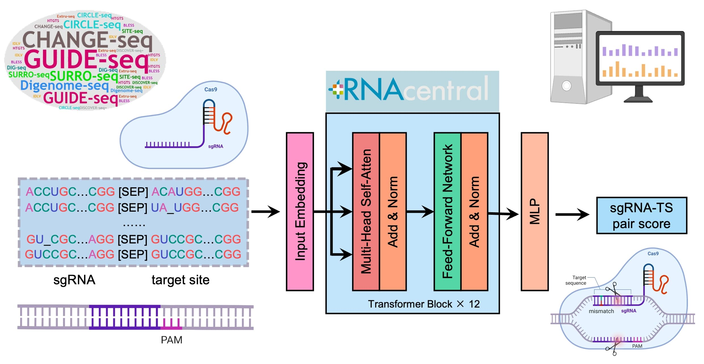

# CCLMoff: CRISPR/Cas Language Model for Off-Target Prediction



Genome editing with the CRISPR/Cas9 system has revolutionized life and medical sciences, particularly in treating monogenic human genetic diseases, by offering long-term therapeutic effects from a single intervention. However, CRISPR/Cas9 can tolerate mismatches and DNA/RNA bulges at target sites, leading to unintended off-target effects that pose challenges for gene-editing therapy development.

To address these limitations, we introduce **CRISPR/Cas Language Model for Off-Target Prediction (CCLMoff)**, a deep learning framework that incorporates a pretrained language model from RNAcentral for off-target site prediction. CCLMoff leverages the RNA language model to extract mutual sequence information between sgRNA and target sites and is trained on an extensive dataset. This approach enables CCLMoff to achieve superior performance compared to existing models, accurately identifying off-target sites and demonstrating robust generalization across diverse Next-Generation Sequencing (NGS)-based detection datasets. Additionally, CCLMoff's interpretability highlights the significance of the seed region in off-target prediction, underscoring its advanced analytical capabilities.

The development of CCLMoff paves the way for a comprehensive, end-to-end in silico sgRNA design platform, enhancing the precision and efficiency of sgRNA design and advancing the application of CRISPR/Cas9 in therapeutic contexts.

---

## Key Features
- **Pretrained Language Model**: Utilizes RNAcentral's pretrained language model for enhanced mutual sequence information extraction.
- **High Accuracy**: Superior performance in off-target site identification compared to existing models.
- **Generalization**: Robust results across diverse NGS-based detection datasets.
- **Interpretability**: Highlights the significance of the seed region in off-target prediction.
- **Support for Evaluating sgRNA-Target Site Pairs**: Evaluates whether a given sgRNA and target site pair constitutes a potential off-target site.
- **Preprocessing Script**: Includes a preprocessing script (`preprocess.py`) to generate all possible sgRNA-target site mismatch pairs using Cas-OFFinder.
- **Pre-trained Model**: Includes a ready-to-use pre-trained CCLMoff model for quick and easy predictions.
- **Custom Training Support**: Provides a training script (`train.py`) for fine-tuning or retraining the model on custom datasets.
- **Comprehensive Documentation**: Detailed tutorials and documentation to guide users through setup, usage, and customization.

---

## Getting Started

Follow the steps below to use the CCLMoff model in your research or project.

### Prerequisites
1. **Python >= 3.7**
2. **Required Python Packages**: Install the packages listed in `requirements.txt`.
3. **Cas-OFFinder**: Cas-OFFinder is required for the preprocessing step to generate sgRNA-target site mismatch pairs. Follow the steps below to install it:

   #### Installing Cas-OFFinder
   - **Step 1**: Clone the Cas-OFFinder repository:
     ```bash
     git clone https://github.com/snugel/cas-offinder.git
     ```
   - **Step 2**: Navigate to the Cas-OFFinder directory:
     ```bash
     cd cas-offinder
     ```
   - **Step 3**: Compile the program:
     ```bash
     make
     ```
   - **Step 4**: Add Cas-OFFinder to your system's PATH:
     ```bash
     export PATH=$PATH:$(pwd)
     ```
     (Add this line to your `.bashrc` or `.zshrc` file to make it permanent.)

   - **Step 5**: Verify the installation:
     ```bash
     cas-offinder --help
     ```
     If the installation is successful, you should see the help menu for Cas-OFFinder.

---

### Installation

1. **Clone the Repository**:
   ```bash
   git clone https://github.com/yourusername/CCLMoff.git
   ```

2. **Navigate to the Repository Folder**:
   ```bash
   cd CCLMoff
   ```

3. **Install Dependencies**:
   ```bash
   pip install -r requirements.txt
   ```

---

## Usage

### 1. **Preprocessing with Cas-OFFinder**
For researchers who only have sgRNAs and wish to predict off-target effects, we provide a preprocessing script (`preprocess.py`) that integrates **Cas-OFFinder** to generate all possible sgRNA-target site mismatch pairs. These pairs can then be evaluated using CCLMoff.

To preprocess your data:
```bash
python preprocess.py --sgRNA <sgRNA_sequence> --output <output_file> [--mismatch <mismatch_limit>] [--genome <genome_index>]
```

- Replace `<sgRNA_sequence>` with your sgRNA sequence (e.g., `"GAGTCCGAGCAGAAGAAGAANGG"`).
- Replace `<output_file>` with the desired path to save the output file (e.g., `"output.txt"`).
- Optionally, specify the maximum number of mismatches (`--mismatch`, default: 3) and the genome index (`--genome`, default: `"hg19"`).

Example:
```bash
python preprocess.py --sgRNA GAGTCCGAGCAGAAGAAGAANGG --output output.txt --mismatch 3 --genome hg19
```

The script will generate a file (`output.txt`) containing all possible sgRNA-target site mismatch pairs.

### 2. **Running the Pre-trained Model**
We have included a pre-trained CCLMoff model in the repository for ready-to-use predictions. To run the model on your data:
```bash
python my_model.py --input <input_data> --model <model_path>
```
- Replace `<input_data>` with the path to your input file (e.g., `output.txt` from the preprocessing step).
- Replace `<model_path>` with the path to the pre-trained model weights.

### 3. **Custom Training**
For researchers who wish to train CCLMoff on their own datasets, we provide a training script (`train.py`). This script allows you to fine-tune the model or retrain it from scratch using your data.

To train the model:
```bash
python train.py --data <training_data> --output <output_model_path>
```
- Replace `<training_data>` with the path to your training dataset.
- Replace `<output_model_path>` with the desired path to save the trained model.

---

## Dataset and Model Weights

The training dataset and pre-trained model weights used for developing CCLMoff are available on Figshare. These resources are essential for training, testing, and reproducing the results of the model.

- **Training Dataset**: [Download on Figshare](https://doi.org/10.6084/m9.figshare.27080566.v1)
- **Pre-trained Model Weights**: Included in the repository under `models/`.

---

## License

This project is licensed under the MIT License. For more details, see the [LICENSE.md](LICENSE.md) file.

---

## Contact

For questions, feedback, or support, please open an issue in the repository or contact the repository owner directly:

- **Weian Du**  
  Email: [duwan@mail.sysu.edu.cn](mailto:duwan@mail.sysu.edu.cn)

---

